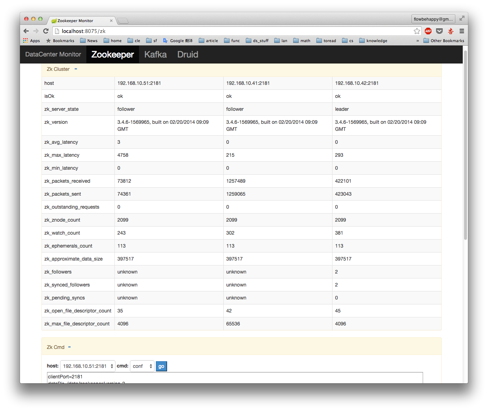
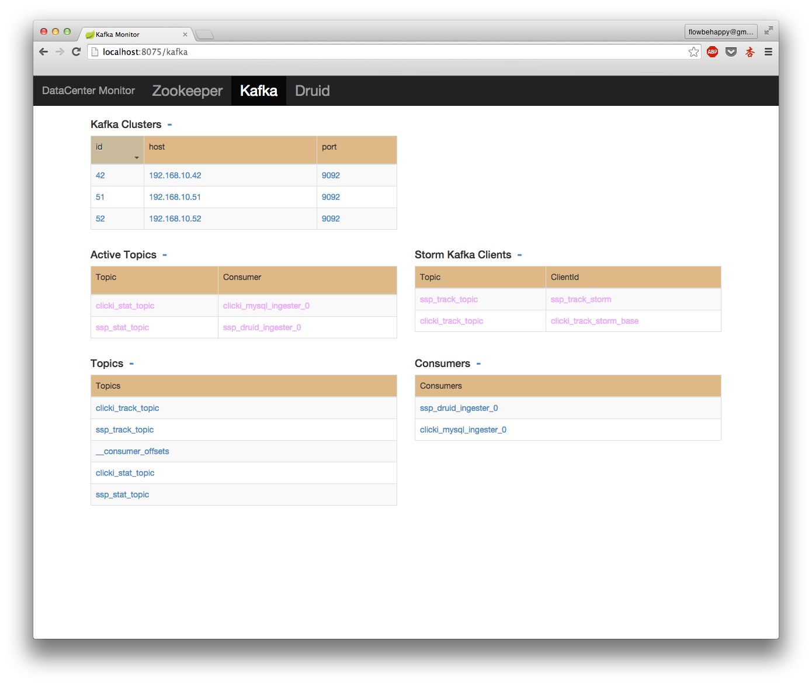
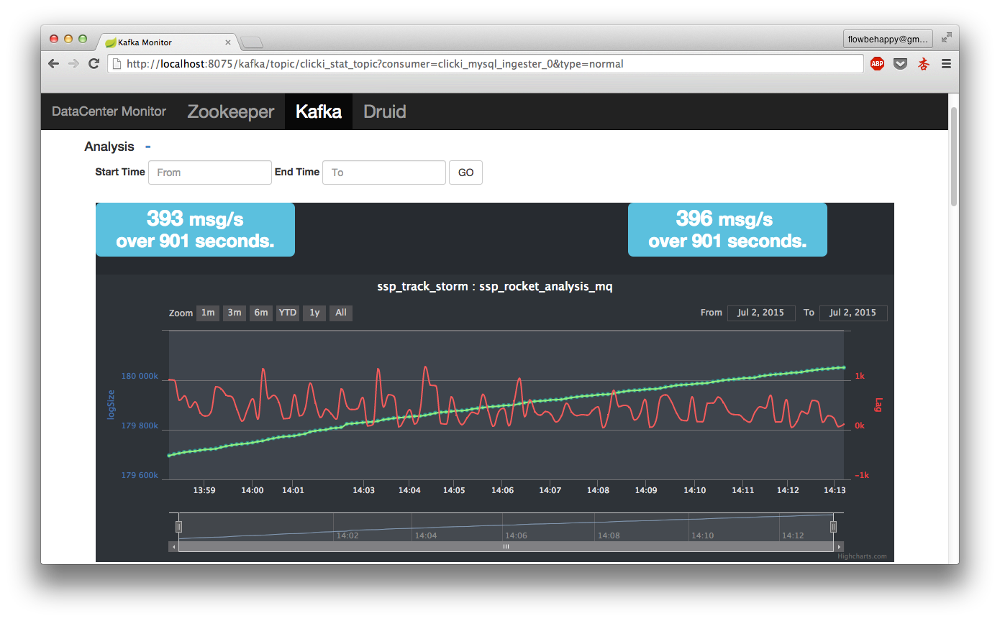

DCMonitor
=====

A simple, lightweight Data Center monitor, currently includes Zookeeper, Kafka, [Druid](http://druid.io/)(in progress). Motivated by [KafkaOffsetMonitor](https://github.com/quantifind/KafkaOffsetMonitor), but faster and more stable.

It is written in java, and use [InfluxDB v0.9](https://github.com/influxdb/influxdb) as historical metrics storage.

###Zookeeper monitor




###Kafka monitor






##Dependences

* Run
	* java(1.6 or later)
	* [netcat](http://netcat.sourceforge.net/)
* Compilation
	* java(1.6 or later)

##Installation

* Set up your Zookeeper, Kafka, Druid(If you have) for monitoring.
* Set up [InfluxDB](https://github.com/influxdb/influxdb) v0.9.
	
	* install influxdb
	
	If v0.9 haven't been finally released by now, you may have to compile it yourself. Check its [doc](https://github.com/influxdb/influxdb/blob/master/CONTRIBUTING.md) to see how to compile InfluxDB.
	
	* create a database for DCMonitor, can be done by sending HTTP POST requests like:
	
	```
	curl -G 'http://192.168.10.60:8086/query?u=root&p=root' --data-urlencode "q=CREATE database dcmonitor"
	
	curl -G 'http://192.168.10.60:8086/query?u=root&p=root&db=dcmonitor' --data-urlencode "q=CREATE RETENTION POLICY seven_days ON dcmonitor DURATION 168h REPLICATION 1 DEFAULT"

	```
	here `192.168.10.60:8086` is where InfluxDB installed, and `168h` shows we only keep the last 7 days historical metrics. Check [here](https://github.com/influxdb/influxdb.org/blob/master/source/docs/v0.9/query_language/database_administration.md) for detail.

* Compile & deploy DCMonitor

	* compile
	
	```
	git clone git@github.com:shunfei/DCMonitor.git
	cd DCMonitor
	./build.sh
	```
Then a `target` folder will be generated under root folder.
	
	* deploy
	
	You only need to deploy `target`, `run.sh`, `config` to target machine. 
	
	Modify configurations in `config/config.json`.
	
	Run `run.sh`, if every thing is fine, visit `http://hostname:8075` to enjoy!
	
	