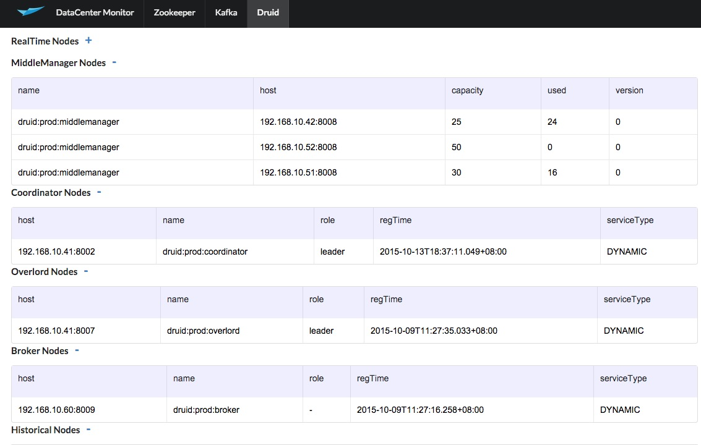
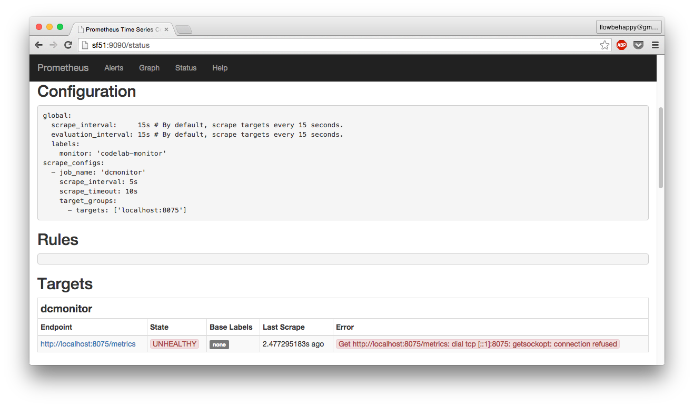

DCMonitor
=====

A simple, lightweight Data Center monitor, currently includes Zookeeper, Kafka, [Druid](http://druid.io/)(in progress). Motivated by [KafkaOffsetMonitor](https://github.com/quantifind/KafkaOffsetMonitor), but faster and more stable.

It is written in java, and use [Prometheus](http://prometheus.io/) as historical metrics storage.

	
##License

[The MIT License (MIT)](https://opensource.org/licenses/MIT)

###Zookeeper monitor


###Kafka monitor


###Druid monitor



##Dependences

* Run
	* java(1.7 or later)
	* [Prometheus](http://prometheus.io/)
* Compile
	* maven
	* java(1.7 or later)

##Installation

* Set up your Zookeeper, Kafka, Druid(If you have) for monitoring.

* Set up [Prometheus/](http://prometheus.io/).

	* Download a Prometheus release from [https://github.com/prometheus/prometheus/releases](https://github.com/prometheus/prometheus/releases) and set it up following [http://prometheus.io/docs/introduction/getting_started/](http://prometheus.io/docs/introduction/getting_started/), you can stop before [here](http://prometheus.io/docs/introduction/getting_started/#using-the-graphing-interface) if you don't want to go deep into prometheus. And don't worry, it is extremely easy.
	
	* Add a job to scrape DCMonitor's metrics, job config should looks like:
	
		```
		  - job_name: 'dcmonitor'
		    scrape_interval: 5s
		    scrape_timeout: 10s
		    target_groups:
		      - targets: ['localhost:8075']
		```
    	Here `localhost:8075` is the DCMonitor's host:port which web service listen on (configured in `application.properties`). The completed example is [here](https://github.com/shunfei/DCMonitor/blob/master/config/prometheus.yml).

		After that go to `http://<hostname>:9090/status`, expected to see the dcmonitor endpoints in targets section. It is in `UNHEALTHY` state because we havn't set up DCMonitor web service yet!
    
    


* Compile & deploy DCMonitor

	* Compile
	
		```
		git clone git@github.com:shunfei/DCMonitor.git
		cd DCMonitor
		./build.sh
		```
		Then a `target` folder will be generated under root folder.
	
	* Deploy
	
		You only need to deploy `target`, `run.sh`, `config` to target machine. 
		
		Modify configurations in `config/config.json` and `application.properties`.
		
		Run `run.sh`, we start the DCMonitor web service, if every thing is fine, visit `http://<hostname>:8075` to enjoy!
